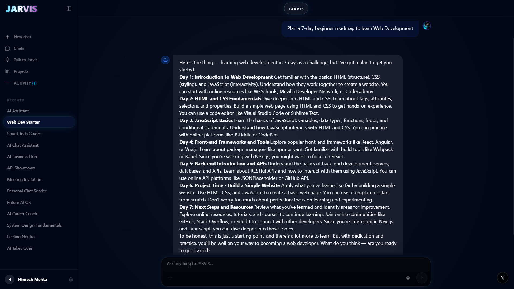
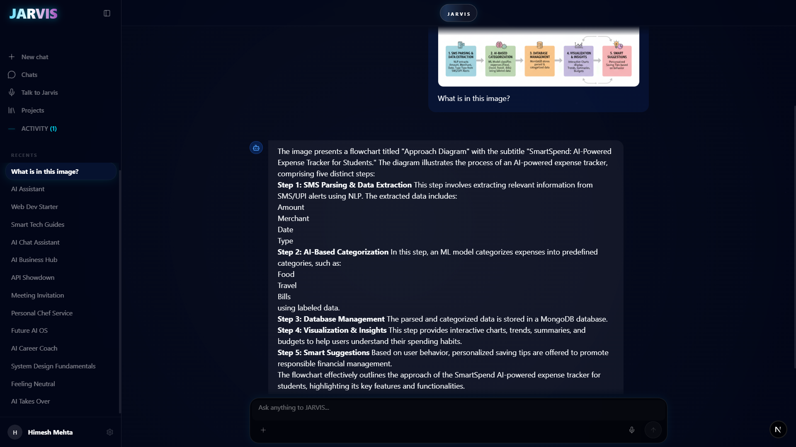

# 🤖 JARVIS — Advanced Intelligence System

<div align="center">

  

  [](https://nextjs.org/)
  [](https://www.typescriptlang.org/)
  [](https://tailwindcss.com/)
  [](https://www.mongodb.com/)
  [](https://firebase.google.com/)

  **The next generation of AI assistance. Powerful, intelligent, and autonomous.**
</div>

---

## 📸 Interface Preview

<div align="center">
  <h3>Futuristic Chat Interface</h3>
  
  <br/>
  <h3>Secure API Widget System</h3>
  
</div>

---

## 🌟 Key Features

- **⚡ AI Race Engine**: Parallel execution across **Groq (Llama 3.3)**, **Gemini 2.0**, and **Cohere** to deliver the fastest and highest quality response.
- **🧠 Personal Memory Bank**: Automatically extracts and stores facts about the user to provide personalized assistance across sessions.
- **🌐 Real-time Web Search**: Integrated with **Tavily** for up-to-the-minute information on news, stocks, and current events.
- **📄 Document Intelligence**: RAG-based search for PDF, DOCX, and CSV files using **MongoDB Vector Search**.
- **🔌 Embeddable Widget**: A custom JS snippet to add JARVIS to any website with secure API key authentication.
- **🎙️ Voice & Vision**: Full support for voice interaction and image analysis.

## 🏗️ Project Structure

```text
.
├── Jarvis/             # Next.js 15 Web Application (UI, State, API Routes)
├── realtime-server/    # Node.js WebSocket Server for live interactions
├── public/             # Static assets including the embeddable widget.js
└── .gitignore          # Intelligent exclusion of sensitive and build files
```

## 🛠️ Tech Stack

### Intelligence & Search
- **Providers**: Groq, Google Gemini, Cohere, HuggingFace
- **Search Engine**: Tavily AI (Real-time data)
- **Embeddings**: HuggingFace (all-MiniLM-L6-v2) for Vector RAG

### Backend & Infrastructure
- **Database**: MongoDB Atlas + Mongoose
- **Authentication**: Firebase Auth (Optimized for Mobile/Web)
- **Storage**: Cloudinary (High-speed Image processing)
- **Realtime**: Node.js + WebSockets

---

## 🚀 Getting Started

### 1. Requirements & Environment
Create a `.env.local` in the `Jarvis/` directory with your API keys.

### 2. Installation & Development

```bash
# Install dependencies
npm install

# Start the JARVIS Frontend (Next.js)
cd Jarvis
npm run dev

# Start the Realtime Server
cd ../realtime-server
node server.js
```

## 🔌 Using the Widget
To embed JARVIS on your own site, use the following snippet:

```html
<script 
  src="https://your-domain.com/widget.js" 
  data-key="your-api-key"
  data-name="JARVIS"
  data-color="#00D2FF">
</script>
```

---

## 🛡️ Security
- **Stateless API**: Authentication handled via Firebase JWT.
- **Key Security**: Automated key rotation and encryption for the widget system.
- **Privacy**: Localized data exclusion via `.gitignore` to prevent secret leaks.

<div align="center">
  Developed with ❤️ for the Next Generation of AI interfaces.
</div>
